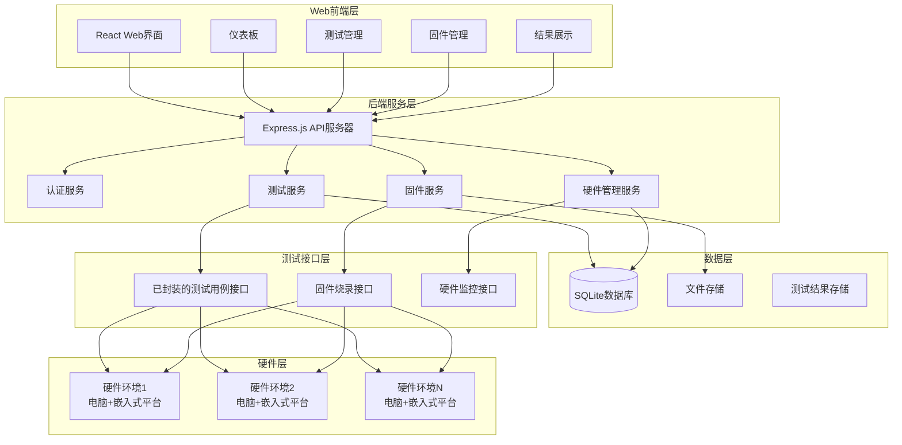
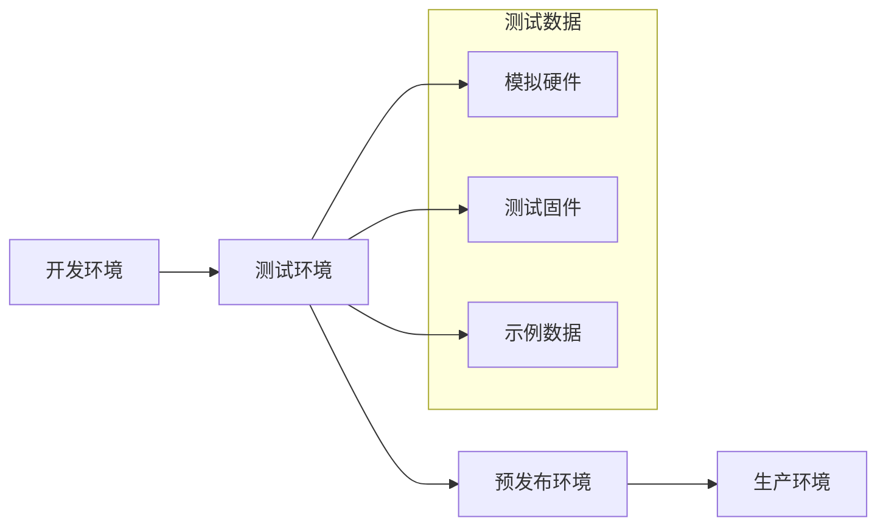

# 设计文档

## 概述

TK8620 Web测试系统是一个基于现代Web技术栈的自动化测试平台，采用前后端分离架构。系统通过RESTful API与已封装的测试用例接口进行交互，提供直观的Web界面用于测试管理、固件管理和结果展示。

## 架构

### 系统架构图



### 技术栈

**前端：**
- React 18 + TypeScript
- Ant Design (UI组件库)
- Recharts (图表库)
- Axios (HTTP客户端)
- Socket.io-client (实时通信)

**后端：**
- Node.js + Express.js
- TypeScript
- Socket.io (实时通信)
- SQLite (数据库)
- Multer (文件上传)

## 组件和接口

### Web界面设计

#### 整体布局框架

```
┌─────────────────────────────────────────────────────────────────────────────────┐
│                           顶部导航栏 (高度: 64px)                                │
│  ┌─────────────────┐                                    ┌─────────────────────┐ │
│  │ TK8620测试系统   │                                    │ 用户头像 | 系统状态  │ │
│  └─────────────────┘                                    └─────────────────────┘ │
├─────────────────────────────────────────────────────────────────────────────────┤
│ 左侧导航栏 (宽度: 240px) │                主内容区域                              │
│ ┌─────────────────────┐ │                                                       │
│ │ 📊 仪表板           │ │                                                       │
│ │ 🧪 测试管理         │ │                                                       │
│ │ 💾 固件管理         │ │                                                       │
│ │ 📈 测试结果         │ │                                                       │
│ │ 🖥️  硬件状态        │ │                                                       │
│ └─────────────────────┘ │                                                       │
│                         │                                                       │
│                         │                                                       │
│                         │                                                       │
│                         │                                                       │
│                         │                                                       │
├─────────────────────────────────────────────────────────────────────────────────┤
│                        底部状态栏 (高度: 32px)                                   │
│  系统版本: v1.0.0  |  连接状态: 正常  |  最后更新: 2025-01-21 10:30:00          │
└─────────────────────────────────────────────────────────────────────────────────┘
```

#### 仪表板页面布局

```
┌─────────────────────────────────────────────────────────────────────────────────┐
│                              仪表板                                              │
├─────────────────────────────────────────────────────────────────────────────────┤
│  ┌─────────────┐  ┌─────────────┐  ┌─────────────┐  ┌─────────────┐            │
│  │ 📊 总测试数  │  │ ✅ 成功率    │  │ 🖥️ 活跃硬件  │  │ 💾 固件版本  │            │
│  │    1,234    │  │   95.6%     │  │    3/4      │  │  v2.1.3     │            │
│  │   +12 今日   │  │  +2.1% ↑   │  │   在线      │  │  最新版本    │            │
│  └─────────────┘  └─────────────┘  └─────────────┘  └─────────────┘            │
├─────────────────────────────────────────────────────────────────────────────────┤
│  ┌─────────────────────────────────┐  ┌─────────────────────────────────────┐  │
│  │          快速操作面板            │  │           最近测试记录               │  │
│  │ ┌─────────────────────────────┐ │  │ ┌─────────────────────────────────┐ │  │
│  │ │ 🚀 开始新测试               │ │  │ │ 压力测试-WiFi连接  ✅ 成功 10:25 │ │  │
│  │ └─────────────────────────────┘ │  │ │ 兼容性测试-v2.1.2  ⏳ 进行 10:20 │ │  │
│  │ ┌─────────────────────────────┐ │  │ │ 功能测试-蓝牙      ❌ 失败 10:15 │ │  │
│  │ │ 📤 上传固件                 │ │  │ │ 性能测试-CPU       ✅ 成功 10:10 │ │  │
│  │ └─────────────────────────────┘ │  │ │ 稳定性测试-内存    ✅ 成功 10:05 │ │  │
│  │ ┌─────────────────────────────┐ │  │ └─────────────────────────────────┘ │  │
│  │ │ 📊 查看详细报告             │ │  │                                     │  │
│  │ └─────────────────────────────┘ │  │                                     │  │
│  └─────────────────────────────────┘  └─────────────────────────────────────┘  │
├─────────────────────────────────────────────────────────────────────────────────┤
│  ┌─────────────────────────────────┐  ┌─────────────────────────────────────┐  │
│  │         测试成功率趋势           │  │          硬件使用率分布              │  │
│  │    100% ┌─────────────────────┐ │  │  ┌─────────────────────────────────┐ │  │
│  │     95% │     ╭─╮     ╭─╮     │ │  │  │        硬件1: 75%               │ │  │
│  │     90% │   ╭─╯ ╰─╮ ╭─╯ ╰─╮   │ │  │  │        硬件2: 50%               │ │  │
│  │     85% │ ╭─╯     ╰─╯     ╰─╮ │ │  │  │        硬件3: 25%               │ │  │
│  │     80% └─────────────────────┘ │  │  │        硬件4: 0% (离线)          │ │  │
│  │         1周  2周  3周  4周      │  │  └─────────────────────────────────┘ │  │
│  └─────────────────────────────────┘  └─────────────────────────────────────┘  │
└─────────────────────────────────────────────────────────────────────────────────┘
```

#### 测试管理页面布局

```
┌─────────────────────────────────────────────────────────────────────────────────┐
│                              测试管理                                            │
├─────────────────────────────────────────────────────────────────────────────────┤
│  🔍 搜索测试用例...  [筛选 ▼] [刷新 🔄]                    [测试配置 ⚙️]        │
├─────────────────────────────────────────────────────────────────────────────────┤
│ ┌─────────────────────────────────────────────────────────┐ ┌─────────────────┐ │
│ │                    测试用例列表                          │ │   快速配置面板   │ │
│ │ ┌─┬─────────────────────┬──────────┬────────┬─────────┐ │ │                 │ │
│ │ │☐│ 测试用例名称         │ 描述      │预计时间│ 操作    │ │ │ 固件选择:       │ │
│ │ ├─┼─────────────────────┼──────────┼────────┼─────────┤ │ │ ┌─────────────┐ │ │
│ │ │☐│ WiFi连接稳定性测试   │ 测试WiFi │ 5分钟  │[运行]   │ │ │ │ v2.1.3 ▼   │ │ │
│ │ │☐│ 蓝牙配对功能测试     │ 测试蓝牙 │ 3分钟  │[运行]   │ │ │ └─────────────┘ │ │
│ │ │☐│ CPU性能压力测试      │ CPU压测  │ 10分钟 │[运行]   │ │ │                 │ │
│ │ │☐│ 内存泄漏检测测试     │ 内存测试 │ 15分钟 │[运行]   │ │ │ 硬件选择:       │ │
│ │ │☐│ 固件升级兼容性测试   │ 兼容测试 │ 8分钟  │[运行]   │ │ │ ┌─────────────┐ │ │
│ │ │☐│ 网络吞吐量测试       │ 网络性能 │ 12分钟 │[运行]   │ │ │ │ 硬件1 ▼     │ │ │
│ │ └─┴─────────────────────┴──────────┴────────┴─────────┘ │ │ └─────────────┘ │ │
│ └─────────────────────────────────────────────────────────┘ │                 │ │
│                                                             │ [⚙️ 详细配置]   │ │
│ ┌─────────────────────────────────────────────────────────┐ │                 │ │
│ │ ☐ 全选  [运行选中用例] [运行全部用例] [批量配置]         │ │ [开始测试]      │ │
│ └─────────────────────────────────────────────────────────┘ └─────────────────┘ │
└─────────────────────────────────────────────────────────────────────────────────┘
```

#### 测试配置弹窗布局

当用户点击"详细配置"按钮时，弹出模态窗口：

```
                    ┌─────────────────────────────────────────────────────────┐
                    │                   测试配置                               │
                    │                                              [✕]        │
                    ├─────────────────────────────────────────────────────────┤
                    │                                                         │
                    │  ┌─────────────────────┐  ┌─────────────────────────┐  │
                    │  │    基础配置          │  │    硬件配置              │  │
                    │  │                     │  │                         │  │
                    │  │ 固件版本:           │  │ 硬件选择:               │  │
                    │  │ ┌─────────────────┐ │  │ ┌─────────────────────┐ │  │
                    │  │ │ v2.1.3 ▼       │ │  │ │ 硬件1 ▼             │ │  │
                    │  │ └─────────────────┘ │  │ └─────────────────────┘ │  │
                    │  │                     │  │                         │  │
                    │  │ 测试模式:           │  │ 串口配置:               │  │
                    │  │ ○ 单次测试          │  │ 串口: ┌─────────────┐   │  │
                    │  │ ● 压力测试          │  │      │ COM3 ▼     │   │  │
                    │  │ ○ 兼容性测试        │  │      └─────────────┘   │  │
                    │  │                     │  │                         │  │
                    │  │ 测试优先级:         │  │ 波特率: ┌─────────────┐ │  │
                    │  │ ┌─────────────────┐ │  │        │ 115200 ▼   │ │  │
                    │  │ │ 高 ▼           │ │  │        └─────────────┘ │  │
                    │  │ └─────────────────┘ │  │                         │  │
                    │  └─────────────────────┘  │ 数据位: ┌─────────────┐ │  │
                    │                           │        │ 8 ▼        │ │  │
                    │  ┌─────────────────────┐  │        └─────────────┘ │  │
                    │  │    压力测试参数      │  │                         │  │
                    │  │                     │  │ 停止位: ┌─────────────┐ │  │
                    │  │ 持续时间:           │  │        │ 1 ▼        │ │  │
                    │  │ ┌─────────────────┐ │  │        └─────────────┘ │  │
                    │  │ │ 30      ▼ 分钟  │ │  │                         │  │
                    │  │ └─────────────────┘ │  │ 校验位: ┌─────────────┐ │  │
                    │  │                     │  │        │ None ▼     │ │  │
                    │  │ 并发数:             │  │        └─────────────┘ │  │
                    │  │ ┌─────────────────┐ │  │                         │  │
                    │  │ │ 10              │ │  │ [🔍 检测串口]           │  │
                    │  │ └─────────────────┘ │  └─────────────────────────┘  │
                    │  │                     │                               │
                    │  │ 重复次数:           │  ┌─────────────────────────┐  │
                    │  │ ┌─────────────────┐ │  │    高级选项              │  │
                    │  │ │ 100             │ │  │                         │  │
                    │  │ └─────────────────┘ │  │ ☐ 失败时自动重试        │  │
                    │  │                     │  │ ☐ 生成详细日志          │  │
                    │  │ 超时设置:           │  │ ☐ 测试完成后发送邮件    │  │
                    │  │ ┌─────────────────┐ │  │ ☐ 保存测试快照          │  │
                    │  │ │ 300     ▼ 秒    │ │  │                         │  │
                    │  │ └─────────────────┘ │  │ 日志级别:               │  │
                    │  └─────────────────────┘  │ ┌─────────────────────┐ │  │
                    │                           │ │ INFO ▼             │ │  │
                    │                           │ └─────────────────────┘ │  │
                    │                           └─────────────────────────┘  │
                    │                                                         │
                    ├─────────────────────────────────────────────────────────┤
                    │              [取消]    [重置]    [保存配置]              │
                    └─────────────────────────────────────────────────────────┘
```

#### 固件管理页面布局

```
┌─────────────────────────────────────────────────────────────────────────────────┐
│                              固件管理                                            │
├─────────────────────────────────────────────────────────────────────────────────┤
│  [📤 上传固件]  🔍 搜索固件版本...  [排序: 时间 ▼]                              │
├─────────────────────────────────────────────────────────────────────────────────┤
│ ┌─────────────────────────────────────────────────────────┐ ┌─────────────────┐ │
│ │                    固件版本列表                          │ │   固件详情      │ │
│ │ ┌─────────────┐ ┌─────────────┐ ┌─────────────┐         │ │                 │ │
│ │ │ 💾 v2.1.3   │ │ 💾 v2.1.2   │ │ 💾 v2.1.1   │         │ │ 版本: v2.1.3    │ │
│ │ │ 最新版本     │ │ 稳定版本     │ │ 历史版本     │         │ │ 大小: 2.5MB     │ │
│ │ │ 2025-01-20  │ │ 2025-01-15  │ │ 2025-01-10  │         │ │ 上传: 1天前     │ │
│ │ │ 2.5MB       │ │ 2.4MB       │ │ 2.3MB       │         │ │                 │ │
│ │ │ [下载][烧录] │ │ [下载][烧录] │ │ [下载][删除] │         │ │ 更新内容:       │ │
│ │ └─────────────┘ └─────────────┘ └─────────────┘         │ │ • 修复WiFi连接  │ │
│ │                                                         │ │ • 优化性能      │ │
│ │ ┌─────────────┐ ┌─────────────┐ ┌─────────────┐         │ │ • 增强稳定性    │ │
│ │ │ 💾 v2.0.9   │ │ 💾 v2.0.8   │ │ 💾 v2.0.7   │         │ │                 │ │
│ │ │ 历史版本     │ │ 历史版本     │ │ 历史版本     │         │ │ 兼容性:         │ │
│ │ │ 2025-01-05  │ │ 2024-12-28  │ │ 2024-12-20  │         │ │ ✅ 硬件1       │ │
│ │ │ 2.2MB       │ │ 2.1MB       │ │ 2.0MB       │         │ │ ✅ 硬件2       │ │
│ │ │ [下载][删除] │ │ [下载][删除] │ │ [下载][删除] │         │ │ ✅ 硬件3       │ │
│ │ └─────────────┘ └─────────────┘ └─────────────┘         │ │ ❌ 硬件4       │ │
│ └─────────────────────────────────────────────────────────┘ │                 │ │
│                                                             │ [下载固件]      │ │
│                                                             │ [烧录到硬件]    │ │
│                                                             └─────────────────┘ │
└─────────────────────────────────────────────────────────────────────────────────┘
```

#### 测试结果页面布局

```
┌─────────────────────────────────────────────────────────────────────────────────┐
│                              测试结果                                            │
├─────────────────────────────────────────────────────────────────────────────────┤
│  📅 日期: [今天 ▼]  📊 状态: [全部 ▼]  🧪 类型: [全部 ▼]  [📤 导出Excel]      │
├─────────────────────────────────────────────────────────────────────────────────┤
│ ┌─────────────────────────────────────────────────────────┐ ┌─────────────────┐ │
│ │                    测试结果列表                          │ │   测试详情      │ │
│ │ ┌────┬──────────────┬────┬──────────┬────────┬────────┐ │ │                 │ │
│ │ │ID  │ 测试名称      │状态│ 开始时间  │ 持续时间│成功率  │ │ │ 测试ID: T001    │ │
│ │ ├────┼──────────────┼────┼──────────┼────────┼────────┤ │ │ 名称: WiFi测试  │ │
│ │ │T001│WiFi连接测试   │✅  │10:25:30  │ 5分钟  │ 100%   │ │ │ 状态: 成功      │ │
│ │ │T002│蓝牙配对测试   │⏳  │10:20:15  │ 进行中 │ --     │ │ │ 开始: 10:25:30  │ │
│ │ │T003│CPU压力测试    │❌  │10:15:45  │ 8分钟  │ 75%    │ │ │ 结束: 10:30:30  │ │
│ │ │T004│内存检测测试   │✅  │10:10:20  │ 12分钟 │ 95%    │ │ │                 │ │
│ │ │T005│兼容性测试     │✅  │10:05:10  │ 15分钟 │ 88%    │ │ │ 测试参数:       │ │
│ │ │T006│网络吞吐测试   │⚠️  │10:00:05  │ 10分钟 │ 92%    │ │ │ 固件: v2.1.3    │ │
│ │ └────┴──────────────┴────┴──────────┴────────┴────────┘ │ │ 硬件: 硬件1     │ │
│ └─────────────────────────────────────────────────────────┘ │ 并发: 10        │ │
│                                                             │                 │ │
│                                                             │ 执行日志:       │ │
│                                                             │ ┌─────────────┐ │ │
│                                                             │ │10:25:30 开始│ │ │
│                                                             │ │10:26:15 连接│ │ │
│                                                             │ │10:28:45 测试│ │ │
│                                                             │ │10:30:30 完成│ │ │
│                                                             │ └─────────────┘ │ │
│                                                             │                 │ │
│                                                             │ [查看完整日志]  │ │
│                                                             └─────────────────┘ │
└─────────────────────────────────────────────────────────────────────────────────┘
```

#### 硬件状态页面布局

```
┌─────────────────────────────────────────────────────────────────────────────────┐
│                              硬件状态                                            │
├─────────────────────────────────────────────────────────────────────────────────┤
│  🔄 自动刷新: [开启]  最后更新: 2025-01-21 10:30:15                             │
├─────────────────────────────────────────────────────────────────────────────────┤
│ ┌─────────────────────────────────────────────────────────┐ ┌─────────────────┐ │
│ │                    硬件环境列表                          │ │   硬件详情      │ │
│ │ ┌─────────────┐ ┌─────────────┐ ┌─────────────┐         │ │                 │ │
│ │ │ 🖥️ 硬件1     │ │ 🖥️硬件2     │ │ 🖥️ 硬件3     │         │ │ 名称: 硬件1     │ │
│ │ │ 🟢 在线      │ │ 🟢 在线      │ │ 🟡 忙碌      │         │ │ 状态: 在线      │ │
│ │ │ 固件: v2.1.3 │ │ 固件: v2.1.2 │ │ 固件: v2.1.3 │         │ │ IP: 192.168.1.10│ │
│ │ │ CPU: 45%     │ │ CPU: 23%     │ │ CPU: 78%     │         │ │                 │ │
│ │ │ 内存: 60%    │ │ 内存: 35%    │ │ 内存: 85%    │         │ │ 硬件规格:       │ │
│ │ │ 最后心跳:1秒前│ │ 最后心跳:2秒前│ │ 最后心跳:1秒前│         │ │ CPU: ARM A7     │ │
│ │ │ [重启][配置] │ │ [重启][配置] │ │ [停止][配置] │         │ │ 内存: 512MB     │ │
│ │ └─────────────┘ └─────────────┘ └─────────────┘         │ │ 存储: 4GB       │ │
│ │                                                         │ │                 │ │
│ │ ┌─────────────┐                                         │ │ 当前任务:       │ │
│ │ │ 🖥️ 硬件4     │                                         │ │ 无              │ │
│ │ │ 🔴 离线      │                                         │ │                 │ │
│ │ │ 固件: --     │                                         │ │ 历史任务:       │ │
│ │ │ CPU: --      │                                         │ │ • WiFi测试 ✅   │ │
│ │ │ 内存: --     │                                         │ │ • 性能测试 ✅   │ │
│ │ │ 最后心跳:5分钟前│                                         │ │ • 压力测试 ❌   │ │
│ │ │ [诊断][重置] │                                         │ │                 │ │
│ │ └─────────────┘                                         │ │ [查看详细日志]  │ │
│ └─────────────────────────────────────────────────────────┘ └─────────────────┘ │
└─────────────────────────────────────────────────────────────────────────────────┘
```

### API接口设计

#### 测试管理API

```typescript
// 获取测试用例列表
GET /api/tests
Response: {
  tests: Array<{
    id: string;
    name: string;
    description: string;
    estimatedTime: number;
    category: string;
  }>
}

// 执行测试用例
POST /api/tests/run
Request: {
  testIds: string[];
  firmwareId: string;
  hardwareId: string;
  config: {
    stressTest?: {
      duration: number;
      concurrency: number;
      iterations: number;
    }
  }
}
Response: {
  jobId: string;
  status: 'queued' | 'running' | 'completed' | 'failed';
}

// 获取测试状态
GET /api/tests/status/:jobId
Response: {
  jobId: string;
  status: string;
  progress: number;
  currentTest: string;
  results: Array<TestResult>;
}
```

#### 固件管理API

```typescript
// 上传固件
POST /api/firmware/upload
Request: FormData with firmware file
Response: {
  firmwareId: string;
  version: string;
  uploadTime: string;
}

// 获取固件列表
GET /api/firmware
Response: {
  firmwares: Array<{
    id: string;
    version: string;
    uploadTime: string;
    fileSize: number;
    status: 'available' | 'in_use' | 'deprecated';
  }>
}

// 烧录固件
POST /api/firmware/:id/flash
Request: {
  hardwareId: string;
}
Response: {
  jobId: string;
  status: string;
}
```

#### 硬件管理API

```typescript
// 获取硬件状态
GET /api/hardware
Response: {
  hardware: Array<{
    id: string;
    name: string;
    status: 'available' | 'busy' | 'offline' | 'error';
    currentFirmware: string;
    lastUpdate: string;
  }>
}

// 获取硬件详情
GET /api/hardware/:id
Response: {
  id: string;
  name: string;
  status: string;
  specs: {
    cpu: string;
    memory: string;
    platform: string;
  };
  currentJob: string;
}
```

## 数据模型

### 数据库设计

```sql
-- 测试用例表
CREATE TABLE test_cases (
    id TEXT PRIMARY KEY,
    name TEXT NOT NULL,
    description TEXT,
    category TEXT,
    estimated_time INTEGER,
    created_at DATETIME DEFAULT CURRENT_TIMESTAMP
);

-- 固件表
CREATE TABLE firmwares (
    id TEXT PRIMARY KEY,
    version TEXT NOT NULL,
    file_path TEXT NOT NULL,
    file_size INTEGER,
    upload_time DATETIME DEFAULT CURRENT_TIMESTAMP,
    status TEXT DEFAULT 'available'
);

-- 硬件环境表
CREATE TABLE hardware_environments (
    id TEXT PRIMARY KEY,
    name TEXT NOT NULL,
    status TEXT DEFAULT 'available',
    current_firmware_id TEXT,
    last_update DATETIME DEFAULT CURRENT_TIMESTAMP,
    FOREIGN KEY (current_firmware_id) REFERENCES firmwares(id)
);

-- 测试任务表
CREATE TABLE test_jobs (
    id TEXT PRIMARY KEY,
    name TEXT,
    status TEXT DEFAULT 'queued',
    firmware_id TEXT,
    hardware_id TEXT,
    config TEXT, -- JSON格式的配置
    created_at DATETIME DEFAULT CURRENT_TIMESTAMP,
    started_at DATETIME,
    completed_at DATETIME,
    FOREIGN KEY (firmware_id) REFERENCES firmwares(id),
    FOREIGN KEY (hardware_id) REFERENCES hardware_environments(id)
);

-- 测试结果表
CREATE TABLE test_results (
    id TEXT PRIMARY KEY,
    job_id TEXT,
    test_case_id TEXT,
    status TEXT,
    start_time DATETIME,
    end_time DATETIME,
    error_message TEXT,
    performance_data TEXT, -- JSON格式的性能数据
    FOREIGN KEY (job_id) REFERENCES test_jobs(id),
    FOREIGN KEY (test_case_id) REFERENCES test_cases(id)
);
```

## 错误处理

### 错误分类

1. **网络错误**
   - 连接超时
   - 服务器不可达
   - API调用失败

2. **硬件错误**
   - 硬件离线
   - 固件烧录失败
   - 测试执行异常

3. **文件错误**
   - 固件上传失败
   - 文件格式不支持
   - 存储空间不足

4. **业务逻辑错误**
   - 测试用例不存在
   - 硬件资源冲突
   - 权限不足

### 错误处理策略

```typescript
// 统一错误响应格式
interface ErrorResponse {
  error: {
    code: string;
    message: string;
    details?: any;
    timestamp: string;
  }
}

// 错误处理中间件
const errorHandler = (error: Error, req: Request, res: Response, next: NextFunction) => {
  const errorResponse: ErrorResponse = {
    error: {
      code: error.name || 'UNKNOWN_ERROR',
      message: error.message,
      timestamp: new Date().toISOString()
    }
  };
  
  // 记录错误日志
  logger.error('API Error:', error);
  
  // 返回错误响应
  res.status(getStatusCode(error)).json(errorResponse);
};
```

## 测试策略

### 单元测试

- **前端组件测试**：使用Jest + React Testing Library
- **API接口测试**：使用Jest + Supertest
- **数据库操作测试**：使用内存SQLite数据库

### 集成测试

- **API集成测试**：测试完整的API调用流程
- **硬件接口测试**：模拟硬件环境进行接口测试
- **端到端测试**：使用Cypress进行完整用户流程测试

### 性能测试

- **负载测试**：模拟多用户并发访问
- **压力测试**：测试系统极限处理能力
- **响应时间测试**：确保API响应时间在2秒内

### 测试环境

